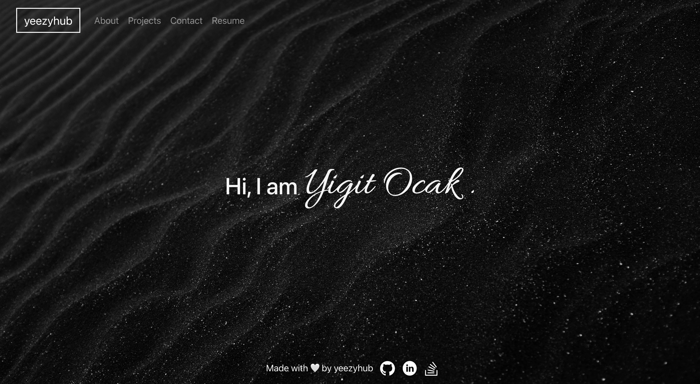

# React-Portfolio

# Deployed Website

[yeezyhub - React Portfolio](https://yeezyhub.github.io/React-Portfolio/)

# Social-Network-API
  

## Description

  Having a portfolio of coding projects is a great way to showcase skills and experience to potential employers during the interview process. A portfolio provides tangible evidence of coding abilities. Then, having a portfolio can help stand out from other candidates and give a competitive edge in the job market.

  Because of that reason, I wanted to create my own portfolio using the knowledge I learned throughout the whole 6 months of boot camp. This project is created with Bootstrap and React which is visually more appealing and more responsive compared to other front-end interfaces and deployed using GitHub pages npm package works with React. Routing is done using React Router which simplifies to implement the routing for the website when using React. Using a popular front-end library used by companies and organizations such as React, is going to help me in terms of the experience.

  The app has the About Me, Projects, Contact Me and Resume navigation links makes it easy to navigate on the website.

## Table of Contents

* [Installation](#installation)
* [Usage](#usage)
* [License](#license)
* [Contributing](#contributing)
* [Tests](#tests)
* [Questions](#questions)

## Installation

  Go to directory of the project, open the console and type in 'npm i' to install the packages needed for this application to run.

## Usage

  After the installation of the packages, type in 'node index.js' or 'npm start' to the console, to start the server.

## License

  [MIT license](https://opensource.org/licenses/MIT)

## Contributing

  None

## Tests

  None

## Questions

  GitHub: [yeezyhub](https://github.com/yeezyhub)  
  Email: yigitbugraocak340@gmail.com
